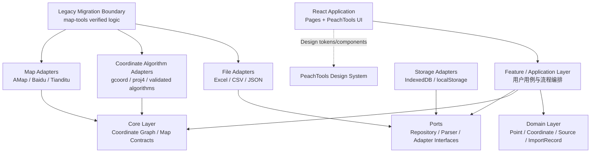
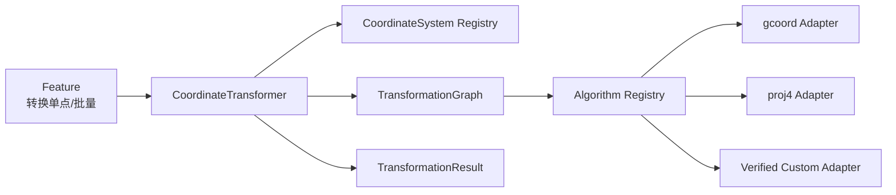
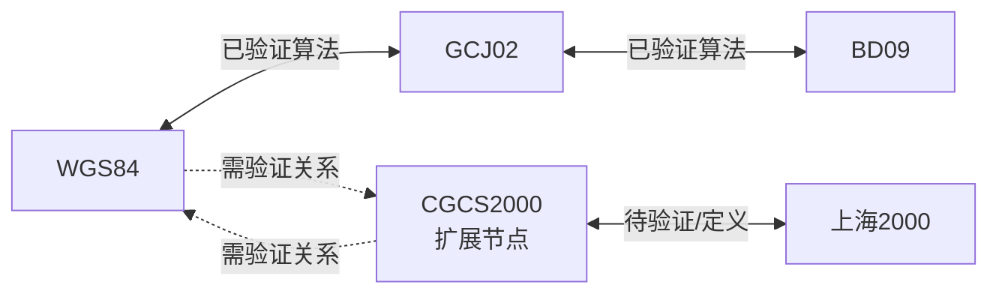
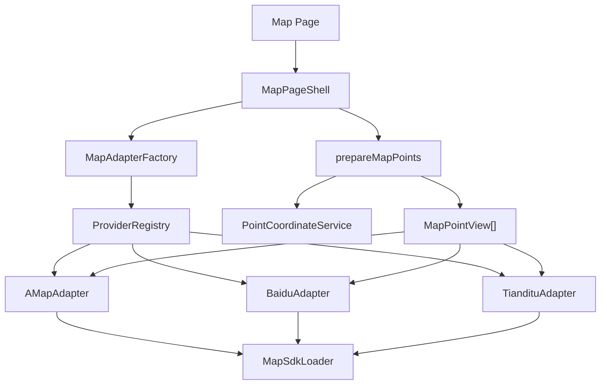
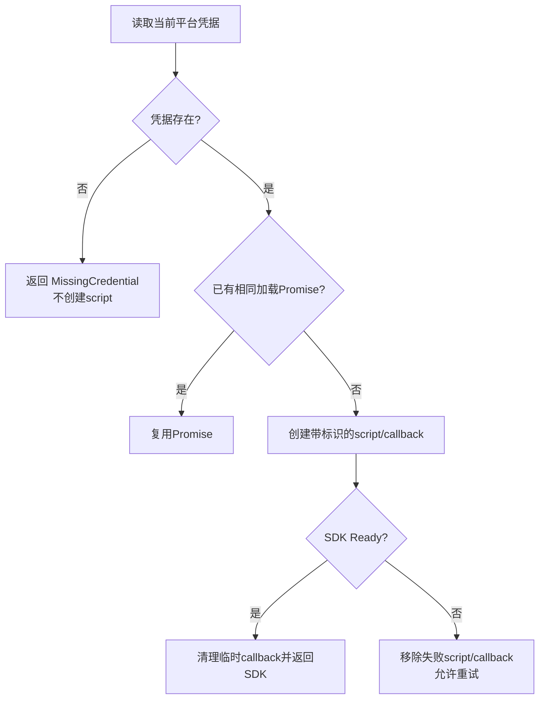
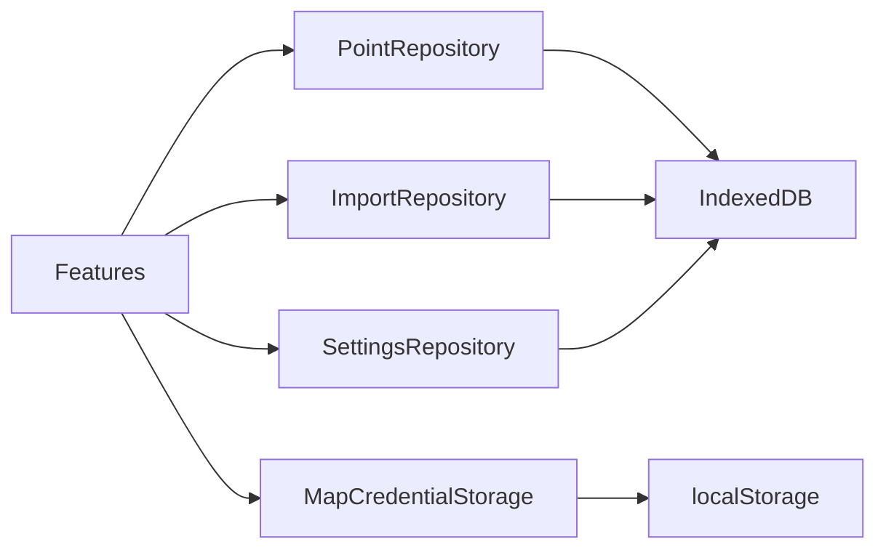
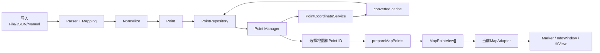
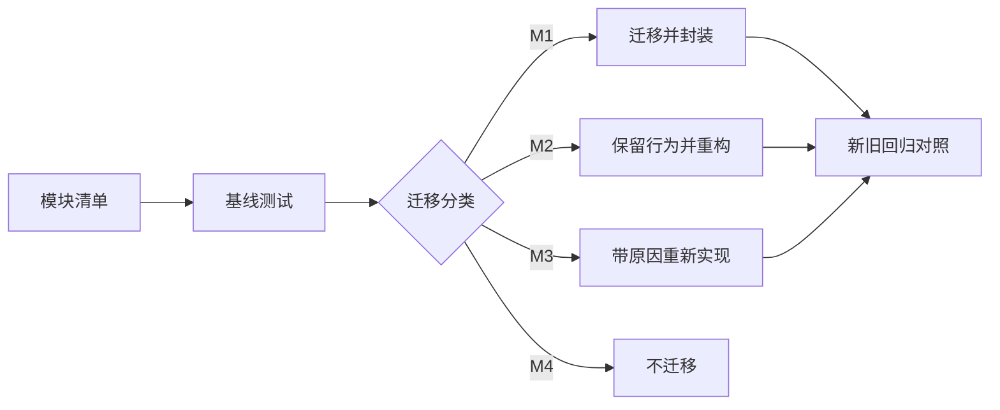

# Coordinate Toolkit V2 架构设计

> 产品：PeachTools Coordinate Toolkit  
> 架构类型：已有能力迁移 + 架构重构 + UI 重做  
> 状态：Draft  
> 更新日期：2026-07-28  
> 关联文档：[PRD V2](./Coordinate-Toolkit-PRD-V2.md) · [TASKS V2](./Coordinate-Toolkit-TASKS-V2.md) · [Reference Analysis](./REFERENCE-ANALYSIS.md) · [Design System](./DESIGN-SYSTEM.md)

## 0. 架构目标与边界

### 0.1 背景

Coordinate Toolkit V2 不是从零开发地图工具。`reference/map-tools` 已提供坐标转换、文件解析、字段处理、点位处理、三地图展示、Marker 和 SDK 动态加载等业务基础；`reference/gisviewer-react` 提供地图容器、配置驱动、能力模块化和生命周期管理经验。

V2 的架构任务是：

- 保留并验证已有成熟业务逻辑；
- 将页面中的业务逻辑拆到稳定模块；
- 统一 Point、Coordinate、Import 数据模型；
- 引入本地持久化；
- 以小型 MapAdapter 隔离三家 SDK；
- 使用 PeachTools Design System 重做 UI；
- 修复旧项目中已经确认的正确性、生命周期和安全问题。

### 0.2 核心原则

> 功能复用，架构重构，UI 重做。

架构决策遵守以下原则：

1. **先验证，后迁移**：已有逻辑先建立基线测试，不因重构无意义重写。
2. **领域模型优先**：页面、文件、地图和存储围绕统一 Point 模型协作。
3. **依赖指向内部**：Domain/Core 不依赖 React、IndexedDB 或地图 SDK。
4. **平台隔离**：高德、百度、天地图通过各自 Adapter 管理。
5. **能力诚实**：平台不支持的能力不提供空实现。
6. **最小抽象**：只抽象 V1 真实共同能力，不建设通用 GIS 框架。
7. **原始坐标不可变**：转换只增加缓存，不覆盖用户输入。
8. **本地优先**：点位和导入记录保存在浏览器，不建设后端。

### 0.3 不属于本架构的内容

- 通用图层管理平台；
- 线、面、GeoJSON 领域模型；
- 轨迹、热力图、三维地图；
- 用户、权限和云同步；
- 自动识别坐标系；
- 异常点或区域判断；
- 任意投影定义编辑器；
- 地图插件市场。

---

# 1. 总体架构

## 1.1 分层结构



## 1.2 各层职责

### React 应用层

包含：

- 应用入口；
- 路由；
- 页面壳；
- Design System Provider；
- 错误边界；
- Feature 组件装配。

职责：

- 展示状态；
- 接收用户操作；
- 调用 Feature 用例；
- 不直接操作 IndexedDB；
- 不直接加载地图 SDK；
- 不包含坐标转换算法。

### Domain 层

包含：

- Point；
- Coordinate；
- CoordinateSystem；
- Source；
- ImportRecord；
- 领域不变量和领域错误。

职责：

- 表达产品核心数据；
- 保证 original 与 converted 的边界；
- 不依赖 React、地图 SDK、文件库或浏览器存储；
- 不包含页面状态。

### Core 层

包含两组稳定契约：

1. Coordinate Core：
   - CoordinateTransformer；
   - TransformationGraph；
   - Algorithm Registry；
   - 转换路径选择；
   - 转换错误和算法版本。
2. Map Core：
   - MapCore；
   - MapAdapter；
   - ProviderRegistry；
   - Capability；
   - MapEvent；
   - MapPointView。

Core 层定义“系统需要什么”，具体库和 SDK 在 Adapter 层实现。

### Feature 层

按用户任务组织：

- points；
- import；
- coordinate-transform；
- map-validation；
- settings；
- home。

职责：

- 编排 Repository、Parser、Transformer 和 MapAdapter；
- 管理单次用户流程状态；
- 输出页面可直接消费的 View State；
- 处理批量进度和部分失败；
- 不包含第三方 SDK 细节。

### Adapter 层

负责外部技术与内部契约之间的转换：

- Excel/CSV/JSON Parser；
- gcoord/proj4 等转换算法适配；
- 高德/百度/天地图 Adapter；
- IndexedDB Repository；
- localStorage Credential Storage；
- 旧 map-tools 逻辑的临时迁移适配。

Adapter 可以依赖 Core/Domain，Core/Domain 不反向依赖 Adapter。

### Storage 层

Storage 是 Adapter 的一个子域，包括：

- IndexedDB schema 和 migration；
- PointRepository；
- ImportRepository；
- SettingsRepository；
- MapCredentialStorage；
- 事务和序列化。

## 1.3 依赖规则

允许：

```text
Page → Feature → Domain/Core Port
Adapter → Domain/Core Port
Storage Adapter → Repository Port
Map Adapter → MapCore Contract
Algorithm Adapter → Coordinate Core Contract
```

禁止：

```text
Domain → React
Domain → IndexedDB
Core → 地图 SDK
Page → 原生地图 SDK
Page → 原生 IndexedDB
MapAdapter → PointRepository
MapAdapter → CoordinateTransformer
FileParser → PointRepository
```

## 1.4 建议目录

```text
src/
├── app/                         # 启动、路由、Provider、错误边界
├── pages/                       # Home、PointManager、三个MapPage
├── components/                  # PeachTools公共展示组件
├── features/
│   ├── home/
│   ├── points/
│   ├── import/
│   ├── coordinate-transform/
│   ├── map-validation/
│   └── settings/
├── domain/
│   ├── point/
│   ├── coordinate/
│   └── import/
├── core/
│   ├── coordinate/
│   └── map/
├── adapters/
│   ├── coordinates/
│   ├── files/
│   ├── maps/
│   ├── storage/
│   └── legacy/
├── config/                      # 无敏感信息的平台和产品配置
├── styles/                      # PeachTools tokens/themes
└── utils/                       # 无业务语义的纯工具
```

`adapters/legacy` 只用于迁移期隔离旧模型和新模型，不应成为永久业务层。

---

# 2. 数据架构

## 2.1 坐标类型设计

坐标需要同时支持经纬度坐标和投影平面坐标。不能用 `lng/lat` 表示所有坐标，否则上海2000的 X/Y 会产生错误语义。

Coordinate 使用统一的数值轴，但显式记录表示形式：

| 字段 | 含义 |
| --- | --- |
| system | 坐标系标识 |
| kind | `geographic` 或 `projected` |
| x | 经度或投影 X |
| y | 纬度或投影 Y |
| unit | `degree` 或 `meter` |
| axisOrder | `xy`；如外部来源不同，在 Parser/Algorithm Adapter 边界归一化 |
| generatedAt | 转换坐标生成时间，可选 |
| algorithmVersion | 转换算法版本，可选 |

不将展示名称、格式化精度或地图 SDK 原生 Point 放入 Coordinate。

## 2.2 CoordinateSystem

### 正式支持

| 标识 | 类型 | 单位 | 用户入口 |
| --- | --- | --- | --- |
| WGS84 | geographic | degree | 是 |
| GCJ02 | geographic | degree | 是 |
| BD09 | geographic | degree | 是 |
| SHANGHAI2000 | projected | meter | 是，验证通过后启用 |

### 扩展验证

| 标识 | 类型 | 单位 | 用户入口 |
| --- | --- | --- | --- |
| CGCS2000 | geographic/需按正式定义 | degree | 默认否 |

CoordinateSystem 不只是一组字符串。系统需要一个只读 Definition Registry，记录：

- 标识；
- 对用户显示的名称；
- geographic/projected；
- 单位；
- 默认轴顺序；
- 是否正式启用；
- 是否允许作为导入源；
- 是否允许作为转换目标；
- 参数/规范来源；
- 当前验证状态。

这样可以为 CGCS2000 增加节点，而不需要修改每个页面中的硬编码数组。

## 2.3 Point

Point 是唯一核心业务实体：

| 字段 | 说明 |
| --- | --- |
| id | 稳定字符串 ID |
| name | 点位名称 |
| source | 来源 |
| coordinates.original | 用户输入/导入的原始坐标 |
| coordinates.converted | 按 CoordinateSystem 索引的转换缓存 |

领域规则：

1. original 创建后不可被转换操作覆盖；
2. converted 不重复保存 original 同坐标系值；
3. converted 只保存成功结果；
4. 转换失败属于操作结果，不写入 Point；
5. Point 不保存原始业务整行；
6. Point 不保存地图 Marker；
7. 删除 Point 时不需要单独删除转换记录，因为缓存随 Point 保存。

## 2.4 Source

Source 记录数据如何进入系统，不保存原始数据：

| 字段 | 说明 |
| --- | --- |
| type | manual、excel、csv、json-file、json-paste |
| importId | 非手动来源关联 ImportRecord |

Source 不保存文件对象、完整文件路径、原始行或任意业务属性。

## 2.5 ImportRecord

ImportRecord 是导入批次摘要：

| 字段 | 说明 |
| --- | --- |
| id | 导入批次 ID |
| sourceType | excel、csv、json-file、json-paste |
| fileName | 文件来源时可选 |
| sheetName | Excel 来源时可选 |
| coordinateSystem | 整批源坐标系 |
| mapping | name/x/y 对应的外部字段 |
| totalRows | 解析总行数 |
| importedRows | 成功写入数量 |
| skippedRows | 跳过数量 |
| createdAt | 导入时间 |

ImportRecord 不保存：

- 原始文件；
- JSON 粘贴全文；
- 原始业务数据；
- 每行错误详情的永久副本。

单次导入结果可以在内存中显示行级错误；持久层只保留摘要。

## 2.6 转换缓存

converted 使用 CoordinateSystem 作为逻辑键：

```text
Point.coordinates.converted
├── WGS84
├── GCJ02
├── BD09
├── SHANGHAI2000
└── CGCS2000（扩展启用后）
```

缓存命中条件：

- 目标坐标存在；
- algorithmVersion 等于当前算法版本；
- 对应坐标系定义版本未变化。

缓存失效条件：

- 算法版本升级；
- 上海2000参数或轴顺序修订；
- 坐标系定义升级；
- 明确执行重新计算。

V1 将缓存放在 Point 内，避免单独转换结果表增加事务复杂度。若未来需要大量算法版本并存，再评估独立 coordinate cache store。

## 2.7 数据不变量

- 所有数值必须是有限数；
- geographic 不等于自动做区域校验；
- projected 不使用经度/纬度字段名；
- original 必须存在；
- Point name 去除首尾空白后非空；
- Source.importId 仅用于非 manual 来源；
- 不通过 `(0,0)` 表示失败；
- 展示精度不影响存储精度。

---

# 3. 坐标转换架构

## 3.1 目标

坐标转换不能由一个大型 switch 写死所有源和目标组合。V2 使用：

- CoordinateTransformer：对 Feature 提供统一转换用例；
- TransformationGraph：选择转换路径；
- Algorithm Registry：注册实际算法边；
- CoordinateSystem Registry：提供坐标定义和启用状态。

## 3.2 组件关系



## 3.3 CoordinateTransformer

职责：

- 接收标准 Coordinate 和目标 CoordinateSystem；
- 检查源/目标定义是否启用；
- 同系转换直接返回；
- 请求 TransformationGraph 选择路径；
- 按路径调用 Algorithm Registry；
- 验证每一步输出为有限数；
- 返回成功结果或结构化错误；
- 记录算法链和综合版本；
- 不负责读取或写入 Point。

PointCoordinateService 位于 Feature 层，负责：

1. 读取 Point；
2. 检查 original 或 converted 缓存；
3. 调用 CoordinateTransformer；
4. 成功后经 Repository 写回 Point。

这样转换算法不依赖 IndexedDB。

## 3.4 TransformationGraph

每种坐标系是节点，每个已验证的直接转换算法是有向边：



Graph 规则：

- 只使用已注册且当前启用的边；
- 路径选择优先较少步骤；
- 同等步骤下优先精度等级更高的边；
- 禁止隐式使用未验证边；
- 路径应包含算法 ID 和版本，便于审计；
- 某个扩展节点未启用时，不影响其他节点转换。

不为所有 N×N 组合分别写实现。例如 WGS84 → BD09 可以通过 WGS84 → GCJ02 → BD09。

## 3.5 Algorithm Registry

每个 Algorithm 描述：

| 属性 | 说明 |
| --- | --- |
| id | 稳定算法 ID |
| source | 源坐标系 |
| target | 目标坐标系 |
| version | 算法/参数版本 |
| status | verified、experimental、disabled |
| precisionClass | 精度等级或误差说明 |
| transform | 单坐标转换能力 |
| supportsBatch | 是否提供优化批量路径 |
| provenance | 算法库、参数和规范来源 |

Registry 的价值：

- 复用 map-tools 已验证逻辑而不把库散落到页面；
- 上海2000参数验证后只需启用对应算法边；
- CGCS2000可作为扩展节点加入；
- 算法升级可触发缓存失效；
- 测试可针对每条边建立 fixture。

## 3.6 正式与扩展状态

### WGS84 / GCJ02 / BD09

优先迁移 map-tools 的 gcoord 路径，并使用旧结果和权威样本做回归。只有确认旧算法存在问题时才替换。

### 上海2000

map-tools 已有 proj4 定义和转换基础。V2 迁移该基础，但算法边初始状态取决于验证：

1. 确认参数来源；
2. 确认投影定义；
3. 确认 EPSG 信息或地方坐标参考的权威等价说明；
4. 确认 X/Y 轴顺序；
5. 用权威双向样本验证；
6. 定义精度标准；
7. 验证通过后设为 verified。

这不是重新实现算法，而是把已有算法产品化、可追溯化。

### CGCS2000

作为扩展节点预留：

- Definition Registry 中存在；
- 默认不显示为用户入口；
- 未验证的 WGS84/CGCS2000 关系不设为 verified；
- 可作为上海2000或天地图 Adapter 的内部坐标节点；
- 是否正式开放由业务样本和天地图契约决定。

## 3.7 批量转换

批量转换由 Feature 层编排：

- 分批读取 Point；
- 先检查缓存；
- 对缺失项调用 Transformer；
- 单点失败不阻断整批；
- 定期输出进度；
- 分批事务写回；
- 支持取消后停止后续批次；
- 不回滚已经明确成功的批次。

结果包含：

- 成功数；
- 缓存命中数；
- 失败数；
- 按错误代码聚合的失败原因；
- 被取消时的已处理数量。

## 3.8 转换错误

错误类型至少区分：

- INVALID_COORDINATE；
- UNSUPPORTED_SYSTEM；
- SYSTEM_NOT_ENABLED；
- NO_TRANSFORMATION_PATH；
- ALGORITHM_NOT_VERIFIED；
- TRANSFORMATION_FAILED；
- CACHE_WRITE_FAILED；
- CANCELLED。

错误不得携带伪造坐标。

---

# 4. 地图架构

## 4.1 架构目标

地图模块只解决 V1 的地图验证任务：

- 初始化当前平台；
- 加载 SDK；
- 设置点位；
- Marker；
- InfoWindow；
- fitView；
- 有限底图切换；
- 清理和销毁。

不建设通用 GIS 图层、绘制、查询、空间分析框架。

## 4.2 组件结构

```text
MapCore
├── MapAdapter
├── MapAdapterFactory
├── ProviderRegistry
├── MapSdkLoader
├── Capability
├── MapEvent
├── MapPointView
├── AMapAdapter
├── BaiduAdapter
└── TiandituAdapter
```



## 4.3 MapCore

MapCore 是契约集合，不是运行时巨型类。它定义：

- Provider 标识；
- Adapter 生命周期；
- 地图事件；
- MapPointView；
- 基础图层选项；
- Capability；
- 标准错误；
- Adapter contract test。

MapCore 不持有所有平台实例，不承担 Point 管理或坐标转换。

## 4.4 MapAdapter

最小公共能力：

| 能力 | 说明 |
| --- | --- |
| initialize | 在指定容器初始化，接收平台配置 |
| setPoints | 以完整 MapPointView 集合替换当前点位 |
| clearPoints | 清除 V2 管理的点位 |
| openInfo | 可选，由点击事件驱动打开信息 |
| fitView | 单点合理缩放，多点适配视野 |
| setBaseLayer | 在声明支持时切换有限底图 |
| on | 订阅标准地图事件并返回 unsubscribe |
| destroy | 释放地图、Overlay、事件和临时资源 |

`setPoints` 语义是“以完整集合替换”，避免 map-tools 分批调用时每次清空前一批的问题。大量点的内部增量处理由平台 PointRenderer 完成。

Adapter 不接收 Domain Point，而接收：

| MapPointView 字段 | 说明 |
| --- | --- |
| id | Point ID |
| name | 安全展示文本 |
| x | 已转换的平台坐标 X/经度 |
| y | 已转换的平台坐标 Y/纬度 |

## 4.5 ProviderRegistry

Registry 保存每个平台描述：

- provider ID；
- Adapter factory；
- SDK 版本；
- 所需凭据类型；
- 目标坐标契约；
- 支持的 Capability；
- 可用基础图层；
- 默认中心和缩放；
- 当前启用状态。

页面通过 provider ID 获取 Adapter，不使用 if/else 创建平台实例。

ProviderRegistry 是静态产品配置，不保存真实 Key。

## 4.6 Capability

V1 基础 Capability：

- markers；
- infoWindow；
- fitView；
- baseLayer（若平台启用）。

未来可选：

- clustering；
- massivePoints；
- drawing；
- distanceMeasure；
- areaMeasure。

规则：

- UI 只显示 Registry 声明且 Adapter contract 验证通过的能力；
- 不支持时不提供空方法；
- 聚合/海量点是渲染 Capability，不改变业务 Point；
- 绘制、测量不属于 V1 基础接口。

## 4.7 SDK 加载

MapSdkLoader 独立于 Adapter 实例。

加载键至少包含：

- provider；
- SDK version；
- credential fingerprint；
- 必要插件集合。

加载流程：



Loader 不负责创建 Map 实例。

## 4.8 Marker 与 InfoWindow

Marker 由平台 PointRenderer 管理：

- 少量点：普通 Marker；
- 中量点：聚合或轻量点；
- 大量点：平台海量点能力；
- 同一时刻只使用一个主要策略；
- 策略阈值通过性能测试确定；
- 不同时创建 MassMarks 和完整 MarkerCluster 副本。

InfoWindow：

- 内容来自 MapPointView；
- 名称按纯文本处理；
- 不拼接未转义 HTML；
- 不显示原始业务整行；
- 至少显示点位名称和当前平台坐标。

## 4.9 生命周期

Adapter 状态：

```text
idle → loading → ready → destroying → destroyed
                 ↘ error
```

要求：

- initialize 不允许并发创建多个实例；
- 异步加载完成前页面卸载时，不再回写状态；
- destroy 幂等；
- 每个事件订阅有 disposer；
- Marker、Layer、InfoWindow、timer、callback、React Root 进入 ResourceBag；
- 页面只创建当前平台 Adapter；
- 切换平台先销毁旧 Adapter；
- SDK 全局对象是否卸载按平台官方建议处理，但应用实例必须释放。

## 4.10 地图坐标准备

MapAdapter 不做坐标转换。Feature 层的 `prepareMapPoints`：

1. 接收 Point ID 和 provider；
2. 从 ProviderRegistry 取得目标坐标系；
3. 从 PointRepository 读取 Point；
4. 调用 PointCoordinateService 命中或生成目标坐标；
5. 只将成功点转换为 MapPointView；
6. 返回成功列表和失败摘要；
7. 调用 Adapter.setPoints。

天地图目标坐标系必须来自验证后的 Provider 配置，不能在 Adapter 内隐式假设 WGS84 等于 CGCS2000。

---

# 5. 文件导入架构

## 5.1 目标

保留 map-tools 的浏览器端解析和字段映射流程，重构为可组合管线：

```text
读取
↓
解析
↓
字段映射
↓
标准化 Point
↓
保存
```

## 5.2 Parser 接口

统一 Parser 概念：

| 输入 | 输出 |
| --- | --- |
| File 或 JSON 文本 | ParsedDataset 或 FileParseError |

ParsedDataset 包含：

- sourceType；
- fileName（可选）；
- sheets（Excel可选）；
- selectedSheet；
- headers；
- rows；
- totalRows；
- parserWarnings。

Parser 只负责语法和结构解析，不负责：

- 自动选择坐标系；
- 创建 Point ID；
- 写 IndexedDB；
- 判断异常点；
- 判断区域；
- 直接渲染预览 UI。

## 5.3 ExcelParser

迁移策略：

- 复用 map-tools 使用 SheetJS 的成熟思路；
- 增加工作表列表；
- 默认第一个可见工作表；
- 用户只能选择一个工作表导入；
- 集中定义文件大小和行数限制；
- 解析失败返回结构化错误；
- 大文件达到阈值时迁入 Worker。

## 5.4 CSVParser

map-tools 的 CSV 业务入口和输出意图保留，但字符串 `split` 实现重新设计。

要求：

- 使用成熟 CSV parser；
- 正确处理 UTF-8 BOM；
- 正确处理引号、逗号、换行和空值；
- 明确列数不一致策略；
- 不将无效数值转换为 0；
- 保留原始文本只到导入会话结束。

## 5.5 JSONParser

V1 支持：

- JSON 文件；
- JSON 粘贴；
- 顶层对象数组。

V1 不支持：

- GeoJSON；
- 顶层单对象；
- 混合标量数组；
- 任意嵌套路径配置。

旧 map-tools 的 GeoJSON properties 分支不迁入 V1。

## 5.6 字段映射

FieldSuggestion 和 ImportMapping 分离：

- FieldSuggestion 可复用 map-tools 的字段匹配思路；
- Suggestion 只负责预填；
- ImportMapping 是用户确认后的结果；
- name/x/y 三个字段必选且不可重复；
- 坐标系必须由用户明确选择；
- 一个导入会话只有一个源坐标系。

## 5.7 标准化

Normalizer 接收：

- ParsedDataset；
- ImportMapping；
- CoordinateSystem；
- 来源信息。

逐行输出：

- ValidNormalizedPoint；
- SkippedRow，包含行号和原因。

标准化规则：

- name 转为文本并去除首尾空白；
- x/y 必须是有限数；
- 不做坐标系自动识别；
- 不做业务异常或区域判断；
- 不保留未映射字段；
- 不创建 `(0,0)` 作为失败占位。

## 5.8 保存

ImportService：

1. 创建 ImportRecord；
2. 为有效行创建 Point；
3. 写入 points 和 imports；
4. 使用同一事务或明确的原子工作单元；
5. 成功后返回 imported/skipped；
6. 数据库失败不显示成功；
7. 防止重复点击提交。

## 5.9 导入状态机

```text
idle
→ reading
→ parsed
→ mapping
→ preview
→ committing
→ completed
↘ failed
```

只有 committing 阶段写数据库。关闭或取消 mapping/preview 不产生持久数据。

---

# 6. 数据存储

## 6.1 存储策略

V2 使用 Repository 模式隔离持久层。



## 6.2 IndexedDB

数据库建议名：`coordinate-toolkit`。

### points store

保存：

- Point；
- original；
- converted cache。

建议索引：

- nameNormalized；
- source.type；
- source.importId。

### imports store

保存 ImportRecord。

建议索引：

- createdAt；
- sourceType；
- coordinateSystem。

### settings store

保存可版本化的非敏感产品设置：

- 主题；
- 表格分页大小；
- 最近使用的地图平台；
- 展示精度；
- 基础功能偏好。

使用单记录或 key/value 结构，必须带 schema version。

### 为什么设置仍保留 localStorage 分支

地图凭据与普通 settings 分开：

- IndexedDB `settings`：产品偏好；
- localStorage `map-credentials`：高德 Key、百度 AK、天地图 Token。

原因：

- 地图页启动前需要同步判断是否有凭据；
- 凭据数据量小；
- 延续 PRD 的本地配置约定。

localStorage 不是安全密钥库。拆分的目的不是增强保密性，而是简化启动读取和避免凭据进入普通设置导出。

## 6.3 Repository

### PointRepository

能力：

- add；
- addMany；
- getById；
- list/query；
- updateConvertedCoordinate；
- delete；
- deleteMany。

`updateConvertedCoordinate` 必须是目标坐标级的原子更新，避免并发生成两个目标坐标时相互覆盖。

### ImportRepository

能力：

- add；
- getById；
- list；
- delete summary（如未来允许）。

V1 删除 ImportRecord 不自动删除 Point；若未来需要批次撤销，应设计独立用例。

### SettingsRepository

能力：

- get；
- set；
- reset；
- schema upgrade。

### MapCredentialStorage

能力：

- getByProvider；
- setByProvider；
- removeByProvider；
- hasCredential。

接口和错误不得输出完整凭据。

## 6.4 事务

需要事务的操作：

- 文件导入：points + imports；
- 批量删除；
- 批量转换缓存写回（可按批次事务）；
- schema migration。

批量转换不要求所有点全局回滚。每批成功后可以提交，并在操作结果中报告失败。

## 6.5 Schema Migration

每次变更记录：

- database version；
- store/index 变化；
- Point/Coordinate 序列化变化；
- 缓存是否失效；
- 可逆性和备份建议。

算法版本变化通常只失效 converted，不修改 original。

## 6.6 错误处理

Storage Error 至少区分：

- DATABASE_UNAVAILABLE；
- QUOTA_EXCEEDED；
- TRANSACTION_ABORTED；
- RECORD_NOT_FOUND；
- SCHEMA_MIGRATION_FAILED；
- SERIALIZATION_FAILED。

Feature 将错误转换为用户可理解文案，Repository 不直接调用 Toast。

---

# 7. 页面与模块关系

## 7.1 页面结构

```text
Home
PointManager
AMapPage
BaiduMapPage
TiandituMapPage
```

### Home

使用：

- home feature；
- 路由；
- Design System；
- 静态平台资源配置。

不读取 Point 数据，不加载地图 SDK。

### PointManager

使用：

- points feature；
- import feature；
- coordinate-transform feature；
- map-validation navigation；
- PointRepository；
- ImportRepository。

它是唯一主要数据工作台。

### MapPages

三个页面共用：

- MapPageShell；
- MapSidebar；
- PointPicker；
- map-validation feature；
- Settings；
- MapCore。

每个页面只创建自己的 Adapter。

## 7.2 核心数据流



## 7.3 手动新增流

```text
AddPointDialog
→ 表单校验
→ 创建 original Coordinate
→ 创建 Point
→ PointRepository.add
→ 刷新 PointManager
```

## 7.4 批量转换流

```text
选择 Point ID
→ 选择目标坐标系
→ PointCoordinateService
→ 缓存检查
→ CoordinateTransformer
→ Repository 写回
→ 显示成功/失败/缓存命中
```

## 7.5 地图验证流

```text
选择 Point ID + provider
→ ProviderRegistry 获取目标坐标契约
→ prepareMapPoints
→ 按需转换并缓存
→ MapPointView[]
→ Adapter.setPoints
→ fitView
```

## 7.6 React 状态边界

页面本地状态：

- Dialog 是否打开；
- 临时表单；
- 当前搜索；
- 当前选择；
- 导入步骤；
- 操作进度。

持久业务状态：

- Point；
- ImportRecord；
- Settings；
- Credentials。

地图命令状态：

- Adapter lifecycle；
- SDK loading/error；
- 当前渲染策略；
- Overlay 资源。

不把地图 SDK 实例放入通用全局状态管理。

## 7.7 PeachTools Design System 接入

- app 层提供 Theme Provider；
- components 提供跨 Feature 的 PeachTools 封装；
- Feature 组合组件，不复制样式；
- 地图 Sidebar 使用统一 Surface、Form、Dialog 和 Status；
- 原始/转换坐标使用统一 CoordinateBadge；
- Design Token 与业务 Domain 解耦。

---

# 8. 迁移策略

## 8.1 迁移总流程



## 8.2 来自 map-tools

| 能力 | 分类建议 | 迁移策略 |
| --- | --- | --- |
| gcoord转换路径 | M1/M2 | 固定基线，迁出Hook，封装Algorithm |
| proj4上海2000基础 | M2 | 保留参数基础，完成权威验证后启用 |
| TRANSFORM_PATHS | M2 | 转为TransformationGraph注册边 |
| Excel解析 | M1/M2 | 保留SheetJS思路，补Sheet选择和错误边界 |
| CSV入口/流程 | M2/M3 | 保留产品流程，替换split实现 |
| JSON数组解析 | M2 | 保留数组能力，移除V1 GeoJSON分支 |
| 字段匹配 | M2 | 转为Suggestion，用户必须确认 |
| Point原始坐标语义 | M2 | 映射到original + converted |
| 单点/批量转换流程 | M2 | 迁为Feature用例并接入缓存 |
| 三地图Marker | M2 | 保留行为，封装PointRenderer |
| InfoWindow | M3 | 保留信息结构，重新做安全渲染 |
| SDK Promise去重 | M2 | 保留思想，重做ScriptRegistry和清理 |
| 图层切换 | M2 | 只迁移V1有限底图 |
| 高德大量点分层 | M2 | 保留策略思想，修复双重对象/分批清空 |
| 绘制/测量 | M4（V1） | 不迁移到V1基础能力 |
| 天气/POI等 | M4（V1） | 不迁移 |

## 8.3 来自 gisviewer-react

不直接迁移其代码和依赖，参考：

- MapContainer/MapApp 分层思想；
- 配置集中管理；
- Overlay/Layer 独立模块；
- Capability 模块化；
- View destroy；
- 海量点和聚合策略。

不采用：

- 巨型 Facade；
- 不完整公共接口；
- 大量 any；
- ArcGIS/3D/轨迹等依赖；
- 静态实例无界缓存；
- 硬编码 Key/Token/内网地址。

## 8.4 重新设计内容

### 数据模型

原因：旧 Point 平铺 current/original，并保存 rawData，只能表达一套转换结果。

### UI

原因：旧页面以地图和独立转换页为中心，缺少 Point Manager、本地持久化和统一 Design System。

### MapAdapter

原因：旧 Hook 接口用空函数模拟能力一致，页面同时创建三个 Hook。

### Storage

原因：旧项目主要使用内存，刷新丢失，没有 Point/Import Repository。

### CSV Parser

原因：旧 split 实现无法可靠处理标准 CSV。

### SDK 生命周期

原因：旧 script ID、callback、Key变化和平台销毁不完整。

## 8.5 迁移验收

每项迁移至少有：

- 旧模块来源；
- 迁移分类；
- 基线样本；
- 新模块目标；
- 行为对照；
- 已修复问题；
- 已知限制。

没有基线或验证结论的“成熟逻辑”不能直接宣布迁移完成。

---

# 9. 技术风险

## 9.1 上海2000

### 风险

map-tools 已有 proj4 转换基础，但参数来源、投影定义、EPSG/地方坐标说明、X/Y 轴序和误差标准尚未形成完整产品证据。

### 影响

- 转换结果可能系统性偏移；
- 错误轴序可能产生看似有效但完全错误的坐标；
- 算法升级可能使已缓存结果失效。

### 应对

- 保留现有算法基础；
- 建立参数来源文档；
- 使用至少三组权威双向样本；
- 明确精度阈值；
- 算法注册为 experimental，验证后改为 verified；
- 版本变化失效相关缓存。

## 9.2 CGCS2000

### 风险

旧项目把 CGCS2000 部分近似按 WGS84 处理，但二者是不同坐标基准体系。实际设备数据和地图使用场景尚未确认。

### 影响

- 用户可能误解两个坐标系等价；
- 天地图验证可能引入未声明误差；
- Point 模型和转换图可能过早扩张。

### 应对

- 作为扩展节点预留；
- 默认不作为用户入口；
- 不注册未验证的等价边；
- 用实际业务样本和正式资料验证；
- 通过 ADR 决定内部节点、扩展入口或不单独使用。

## 9.3 天地图坐标契约

### 风险

旧资料存在“天地图使用 CGCS2000”和“以 WGS84 兼容显示”的不同表达。

### 影响

- Adapter 输入不明确；
- 同一点位可能因隐式转换产生偏差；
- 测试缺少明确期望。

### 应对

- ProviderRegistry 不在验证前固化目标坐标；
- 结合官方契约、实际 Token/SDK 和已知点做对照；
- 形成独立 ADR；
- Adapter 不自行假设；
- 契约变化时更新转换缓存版本。

## 9.4 SDK 生命周期

### 风险

- 全局 callback 冲突；
- script 失败残留；
- Key变化后复用旧 Promise；
- 快速路由切换时异步回写；
- Marker/Layer/事件泄漏；
- 百度/天地图缺少对称 destroy。

### 应对

- ScriptRegistry；
- ResourceBag；
- Adapter 状态机；
- 幂等 destroy；
- generation token/Abort；
- contract test；
- 反复进出地图页的内存测试。

## 9.5 大量 Marker 性能

### 风险

- 每点一个 Marker 和事件；
- MassMarks 与 Cluster 双重对象；
- 分批 setPoints 清空前一批；
- 坐标重复转换；
- 三平台能力不一致。

### 应对

- 完整集合语义的 setPoints；
- PointRenderStrategy；
- 同时只使用一种主策略；
- 坐标缓存；
- 1k/10k/50k 基准；
- 平台能力降级；
- 生命周期后对象数量回落检查。

## 9.6 迁移回归风险

### 风险

架构重构可能改变旧项目已经正确的坐标、解析或地图行为。

### 应对

- Phase 0 基线测试；
- legacy-vs-v2 对照；
- 算法和解析结果 fixture；
- 每项重新实现必须有明确缺陷原因；
- 不用“代码更干净”作为改变业务结果的理由。

## 9.7 文件与内存

### 风险

大型 Excel/JSON 一次读入内存，导致 UI 阻塞或浏览器崩溃。

### 应对

- 文件大小/行数限制；
- 预览采样；
- Worker 阈值；
- 分批标准化和写入；
- 不永久保存 rawData；
- 支持取消。

## 9.8 本地存储

### 风险

- IndexedDB 不可用或配额不足；
- schema migration 失败；
- localStorage 凭据可被同源脚本读取。

### 应对

- 结构化存储错误；
- migration 测试；
- 不引入不可信第三方脚本；
- UI 明示凭据存储边界；
- 不在日志/URL/导出中包含凭据。

## 9.9 架构过度设计

### 风险

为了统一三地图而建设大型 GIS 框架，增加接口、注册器和抽象层，反而降低可维护性。

### 应对

- MapAdapter 只含 V1 共同能力；
- Capability 按真实需求增加；
- 不建设通用 Geometry/Layer/Plugin 系统；
- 优先普通对象和明确函数；
- 每个抽象必须至少解决两个真实调用方或一个明确的外部边界。

---

# 10. 关键架构决策摘要

| 决策 | 结论 |
| --- | --- |
| 产品架构 | 迁移已有能力，不从零重写 |
| Point | original + converted cache |
| 投影坐标 | Coordinate显式kind/unit，不滥用lng/lat |
| 转换 | Transformer + Graph + Algorithm Registry |
| 上海2000 | 迁移已有基础，验证后正式启用 |
| CGCS2000 | 扩展节点，默认不作为用户入口 |
| 地图 | 小型MapAdapter，不建设GIS框架 |
| 地图坐标 | Feature准备，Adapter不转换 |
| SDK | 独立Loader + ScriptRegistry |
| Marker | Adapter内部PointRenderer策略 |
| 导入 | Parser → Mapping → Normalize → Repository |
| Point/Import/Settings | IndexedDB + Repository |
| 地图凭据 | localStorage独立存储 |
| UI | PeachTools Design System重做 |
| 旧逻辑 | 基线测试后按M1–M4迁移 |

## 10.1 后续 ADR

实施前或实施过程中至少需要以下架构决策记录：

1. ADR-001：产品化迁移策略；
2. ADR-002：上海2000定义、参数和精度；
3. ADR-003：CGCS2000与WGS84关系；
4. ADR-004：天地图目标坐标契约；
5. ADR-005：地图SDK加载和Key变化策略；
6. ADR-006：大量点渲染阈值；
7. ADR-007：IndexedDB库和schema版本策略。

## 10.2 架构验收标准

- Domain/Core 不依赖 React、地图 SDK 或 IndexedDB；
- 页面不直接访问 SDK/IndexedDB；
- map-tools 成熟逻辑有迁移来源和回归测试；
- Point 原始坐标不会被转换覆盖；
- 转换路径通过 Graph/Registry 组合，不写死所有组合；
- CGCS2000可扩展但默认不进入用户入口；
- 三地图只实现最小共同能力；
- 无 Key 不加载 SDK；
- destroy 可重复调用且释放应用资源；
- 导入确认前不写数据库；
- points/imports/settings 有 Repository；
- UI 使用 PeachTools Design System；
- 未扩张为大型 GIS 框架。

