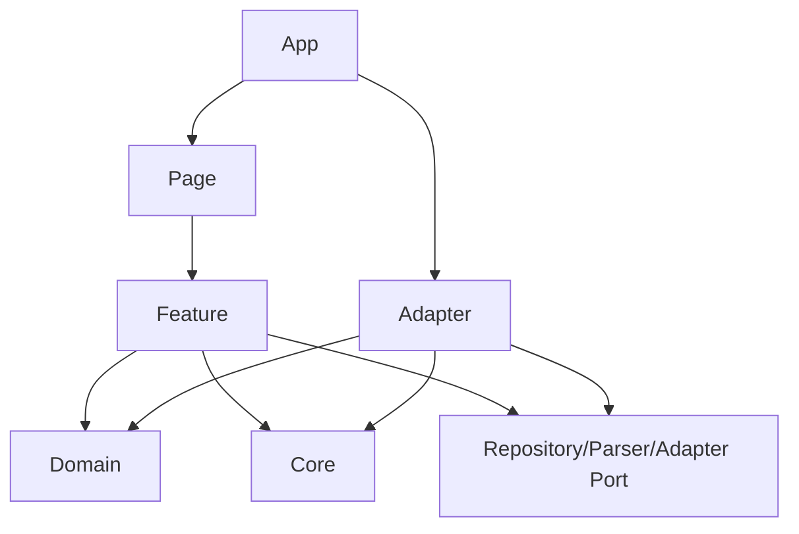

# Coordinate Toolkit V2 项目结构设计

> 状态：开发前设计  
> 日期：2026-07-28  
> 约束：本文只定义结构，不创建项目或源码  
> 关联文档：[Architecture](./ARCHITECTURE.md) · [TASKS V2](./Coordinate-Toolkit-TASKS-V2.md) · [Design System](./DESIGN-SYSTEM.md)

# 1. 项目技术栈

## 1.1 基础技术

| 技术 | 决策 | 用途 |
| --- | --- | --- |
| React | 使用 | 页面和Feature UI |
| TypeScript | 使用，strict | Domain、Core、Adapter契约 |
| Vite | 使用 | 开发和生产构建 |
| pnpm | 使用 | 依赖管理和锁文件 |
| React Router | 使用 | 五个页面路由 |
| IndexedDB | 使用 | points/imports/settings |
| localStorage | 使用 | 地图凭据和少量启动配置 |
| Vitest | 建议使用 | 单元和契约测试 |
| Testing Library | 建议使用 | React交互测试 |
| Playwright | 建议使用 | 核心流程E2E和地图集成 |

版本在项目初始化时根据PeachTools现有工程基线确定，不在本设计文档锁定具体小版本。

## 1.2 样式方案

### Tailwind CSS

建议使用，前提是PeachTools Design System已有Tailwind preset或可将语义Token映射为Tailwind主题。

适合：

- 布局；
- 间距；
- 响应式；
- 常规排版；
- Design Token工具类。

限制：

- 不直接使用任意颜色代替语义Token；
- 不在业务页面堆积不可读的超长class；
- 不绕过PeachTools组件规范。

### CSS Modules

建议有限使用。

适合：

- 地图容器尺寸和SDK相关覆盖；
- 复杂组件局部样式；
- 无法用Design System/Tailwind清楚表达的状态；
- 第三方SDK样式隔离。

不作为每个简单组件的默认方案。

### Styled Components

不建议使用。

原因：

- 与Tailwind和Design Token体系重复；
- 增加运行时样式开销；
- 引入第三种样式范式；
- 对本工具没有明确必要性。

### 最终建议

> PeachTools Design System组件 + CSS变量语义Token + Tailwind布局工具 + 少量CSS Modules。

如果PeachTools已有官方样式方案，以官方方案优先，避免自建重复组件。

## 1.3 状态管理

初始不引入大型全局状态库。

建议：

- Repository负责持久业务数据；
- Feature hooks/use-cases负责流程状态；
- React Context只用于主题、依赖注入和少量跨页服务；
- 地图SDK实例保存在Adapter内部；
- 页面间地图选择可使用小型会话Store或路由状态。

只有出现明确复杂跨Feature状态后，再通过ADR引入状态库。

## 1.4 依赖选择原则

- 优先复用map-tools已验证的gcoord、proj4和SheetJS使用经验；
- CSV使用成熟解析库，不沿用字符串split；
- 地图使用三家官方Web SDK；
- 每个依赖必须有明确模块边界；
- 页面不得直接导入算法库或SDK；
- 不引入ArcGIS、Mapbox、Three.js等非V1依赖。

---

# 2. 源码目录结构

```text
src/
├── app/
│   ├── App
│   ├── router
│   ├── providers
│   └── error-boundary
├── pages/
│   ├── Home/
│   ├── PointManager/
│   ├── AMapPage/
│   ├── BaiduMapPage/
│   ├── TiandituPage/
│   └── NotFound/
├── components/
│   ├── feedback/
│   ├── forms/
│   ├── layout/
│   └── data-display/
├── features/
│   ├── home/
│   ├── points/
│   ├── import/
│   ├── coordinate-transform/
│   ├── map-validation/
│   └── settings/
├── domain/
│   ├── point/
│   ├── coordinate/
│   └── import/
├── core/
│   ├── coordinate/
│   └── map/
├── adapters/
│   ├── coordinates/
│   ├── files/
│   ├── maps/
│   ├── storage/
│   └── legacy/
├── config/
├── hooks/
├── styles/
└── utils/
```

## 2.1 app

职责：

- React应用启动；
- 路由装配；
- Theme/Dependency Provider；
- 全局ErrorBoundary；
- 页面级Suspense；
- 依赖实例装配。

不放：

- 坐标算法；
- Point业务规则；
- SDK具体实现；
- 页面业务流程。

## 2.2 pages

职责：

- 路由入口；
- 组合Feature组件；
- 页面级布局和标题；
- 处理路由参数；
- 不实现底层业务逻辑。

## 2.3 components

跨Feature的PeachTools UI组件：

- LoadingState；
- EmptyState；
- ErrorState；
- ConfirmDialog；
- FormField；
- CoordinateBadge；
- 页面布局组件。

组件不读取Repository，不调用地图SDK。

## 2.4 features

按用户任务组织流程。Feature可以依赖Domain/Core接口和Repository端口，不能依赖另一个Feature的内部文件。

跨Feature协作通过：

- 公共Domain类型；
- Application service；
- 明确的Feature public API。

## 2.5 domain

纯业务模型和规则：

- Point；
- Coordinate；
- CoordinateSystem；
- Source；
- ImportRecord；
- Repository端口；
- 领域错误。

Domain不依赖React、浏览器API或第三方SDK。

## 2.6 core

稳定的技术无关核心契约：

- 坐标转换图和算法注册；
- 地图Adapter和Capability。

Core不负责页面状态和持久化。

## 2.7 adapters

实现外部技术：

- 算法库；
- 文件库；
- 地图SDK；
- IndexedDB/localStorage；
- 迁移期旧模型适配。

## 2.8 config

保存非敏感产品配置：

- Provider元数据；
- 默认中心/缩放；
- 文件大小和行数限制；
- 功能开关；
- 外部资源链接。

不保存真实Key、AK、Token。

## 2.9 hooks

只放跨Feature通用的React Hook。

不将所有业务逻辑都命名为Hook；纯业务用例放Feature/Core，地图实例放Adapter。

## 2.10 styles

- PeachTools语义Token；
- 深浅主题；
- Tailwind入口或preset连接；
- 全局reset；
- 地图SDK必要覆盖。

## 2.11 utils

只放无业务语义的纯工具，例如：

- 安全文本处理；
- 日期格式化；
- 有限数判断；
- 小型集合工具。

坐标、文件、地图、存储逻辑不得笼统放入utils。

---

# 3. 模块依赖关系

## 3.1 允许的依赖



具体规则：

- Page → Feature；
- Feature → Domain/Core；
- Feature → Repository/Parser/Adapter接口；
- Adapter实现接口；
- App负责依赖装配；
- components可依赖Design System和通用类型；
- Domain/Core不依赖外层。

## 3.2 禁止的依赖

- Domain依赖React；
- Domain依赖IndexedDB；
- Core依赖地图SDK；
- Core依赖gcoord/proj4具体实现；
- Page直接操作IndexedDB；
- Page直接读取localStorage；
- Page直接调用高德/百度/天地图SDK；
- MapAdapter调用PointRepository；
- MapAdapter执行坐标转换；
- FileParser写入Repository；
- Feature导入另一个Feature的内部实现；
- config包含真实凭据；
- utils成为业务逻辑集中区。

## 3.3 依赖装配

App providers负责创建：

- CoordinateSystem Registry；
- TransformationGraph；
- Algorithm Registry；
- CoordinateTransformer；
- PointRepository；
- ImportRepository；
- SettingsRepository；
- MapCredentialStorage；
- MapAdapterFactory。

Feature通过依赖注入取得接口，测试可替换为内存实现或mock。

## 3.4 Public API规则

每个Feature/Core模块提供单一公开入口。

其他模块只能导入公开入口，不能穿透访问内部文件。这样可避免重构时产生新的跨目录耦合。

---

# 4. 页面规划

## 4.1 Home

路由：`/`

职责：

- 展示“设备点位坐标转换与地图验证工作台”定位；
- 展示导入→管理→转换→验证流程；
- 提供Point Manager和三地图入口；
- 提供地图平台官网和文档链接；
- 说明本地数据处理。

不读取Point，不加载地图SDK。

## 4.2 PointManager

路由：`/points`

职责：

- 点位列表；
- 搜索和选择；
- 手动新增；
- Excel/CSV/JSON/粘贴导入；
- 点位详情；
- 单个/批量转换；
- 单个/批量删除；
- 进入地图验证。

它是V1唯一主要数据工作台。

## 4.3 AMapPage

路由：`/map/amap`

职责：

- 高德Key状态；
- Point选择；
- GCJ02 MapPointView；
- Marker、InfoWindow、fitView；
- 有限高德底图能力；
- SDK加载和错误状态。

只使用AMapAdapter。

## 4.4 BaiduMapPage

路由：`/map/baidu`

职责：

- 百度AK状态；
- Point选择；
- BD09 MapPointView；
- Marker、InfoWindow、fitView；
- 有限百度底图；
- SDK加载和错误状态。

只使用BaiduAdapter。

## 4.5 TiandituPage

路由：`/map/tianditu`

职责：

- 天地图Token状态；
- Point选择；
- 使用已确认坐标契约准备MapPointView；
- Marker、InfoWindow、fitView；
- 矢量/影像/地形等验证后底图；
- SDK加载和错误状态。

不在页面内假设WGS84等于CGCS2000。

## 4.6 NotFound

职责：

- 说明页面不存在；
- 返回首页或Point Manager；
- 不出现空白页。

---

# 5. Feature规划

## 5.1 home

负责：

- 首页内容配置；
- 工具入口；
- 平台资源卡；
- 不包含业务数据。

## 5.2 points

负责：

- Point查询；
- 搜索、分页、选择；
- 新增；
- 详情；
- 删除；
- CoordinateStatus；
- Point Manager页面状态。

依赖PointRepository。

## 5.3 import

负责：

- 导入会话状态机；
- 数据源选择；
- Parser调度；
- 工作表选择；
- 字段建议和映射；
- 坐标系选择；
- 标准化；
- ImportService；
- 结果统计。

依赖Parser接口、PointRepository和ImportRepository。

## 5.4 coordinate-transform

负责：

- PointCoordinateService；
- 缓存命中；
- 单点转换；
- 批量转换；
- 进度、取消和部分失败；
- converted写回。

依赖CoordinateTransformer和PointRepository。

## 5.5 map-validation

负责：

- 地图点位选择；
- provider选择；
- prepareMapPoints；
- Point ID到MapPointView转换；
- 部分转换失败；
- MapPageShell和Sidebar；
- Adapter生命周期编排。

依赖PointRepository、PointCoordinateService和MapAdapterFactory。

## 5.6 settings

负责：

- 主题；
- 表格和展示设置；
- 地图凭据Dialog；
- 本地存储说明；
- 设置重置。

依赖SettingsRepository和MapCredentialStorage。

---

# 6. Core规划

## 6.1 core/coordinate

包含：

- CoordinateTransformer；
- CoordinateSystem Registry；
- TransformationGraph；
- Algorithm Registry；
- TransformResult；
- TransformError；
- PathSelector；
- 版本和缓存签名规则。

不包含：

- gcoord/proj4具体调用；
- React Hook；
- IndexedDB；
- Point列表UI。

## 6.2 core/map

包含：

- MapCore公共类型；
- MapAdapter；
- MapAdapterFactory接口；
- ProviderRegistry；
- Capability；
- MapEvent；
- MapError；
- MapPointView；
- ResourceBag；
- PointRenderStrategy接口；
- Adapter contract test。

不包含：

- 三家SDK具体类型；
- 坐标转换；
- Repository；
- 通用Geometry/Layer/Plugin系统。

---

# 7. Adapter规划

## 7.1 adapters/coordinates

包含：

- gcoord适配；
- proj4适配；
- 上海2000参数实现；
- 算法注册；
- 旧结果回归测试。

具体库只在此处出现。

## 7.2 adapters/files

包含：

- ExcelParser；
- CSVParser；
- JSONParser；
- ParserRegistry；
- 文件错误；
- Worker入口（达到阈值时）。

## 7.3 adapters/maps

```text
maps/
├── shared/
│   ├── MapSdkLoader
│   └── ScriptRegistry
├── amap/
│   ├── AMapAdapter
│   ├── AMapLoader
│   └── AMapPointRenderer
├── baidu/
│   ├── BaiduAdapter
│   ├── BaiduLoader
│   └── BaiduPointRenderer
└── tianditu/
    ├── TiandituAdapter
    ├── TiandituLoader
    └── TiandituPointRenderer
```

每个平台独立管理SDK类型和生命周期。

## 7.4 adapters/storage

包含：

- IndexedDB database/schema/migrations；
- IndexedDbPointRepository；
- IndexedDbImportRepository；
- IndexedDbSettingsRepository；
- LocalMapCredentialStorage；
- 序列化和存储错误。

## 7.5 adapters/legacy

仅用于迁移期：

- 旧Point到新Point映射；
- 旧转换结果对照；
- 旧导出文件兼容；
- 临时调用旧纯逻辑（如迁移策略需要）。

约束：

- 不能被Page直接调用；
- 不保存新业务逻辑；
- 每个文件有移除条件；
- 核心迁移完成后逐步删除；
- 旧参考项目保持只读。

---

# 8. 初始开发顺序

项目实现顺序基于TASKS V2，但把技术落地拆为更清晰的九个阶段。

## Phase 0：基线测试和迁移分析

- 建立map-tools模块清单；
- 建立gisviewer-react架构参考；
- 完成M1–M4矩阵；
- 固定坐标、文件、字段和Marker行为；
- 记录已知缺陷；
- 确认上海2000和CGCS2000验证计划。

完成门槛：迁移矩阵和基线测试通过评审。

## Phase 1：项目初始化

- React + TypeScript + Vite + pnpm；
- 路由；
- Design System；
- 测试框架；
- 依赖装配；
- 目录边界。

完成门槛：空页面构建、类型和基础UI测试通过。

## Phase 2：Domain模型

- CoordinateSystem；
- Coordinate；
- Point；
- Source；
- ImportRecord；
- Repository端口；
- 错误模型。

完成门槛：领域不变量和旧模型映射测试通过。

## Phase 3：Storage

- IndexedDB schema；
- points/imports/settings；
- Repository实现；
- localStorage凭据；
- 事务；
- migration。

完成门槛：刷新持久化、CRUD、事务和迁移测试通过。

## Phase 4：Coordinate Engine

- Registry；
- Graph；
- Algorithm Registry；
- 迁移gcoord/proj4；
- 上海2000验证；
- CGCS2000扩展节点；
- 缓存版本。

完成门槛：旧结果回归和权威样本满足精度标准。

## Phase 5：File Import

- Excel/CSV/JSON Parser；
- JSON粘贴；
- 字段Suggestion/Mapping；
- Normalize；
- ImportService；
- 导入事务。

完成门槛：五种录入/导入来源和错误统计通过。

## Phase 6：Point Manager

- 列表；
- 搜索/选择；
- 新增；
- 详情；
- 删除；
- 转换；
- 地图查看入口。

完成门槛：Point完整管理闭环通过。

## Phase 7：Map Adapter

- MapCore；
- ProviderRegistry；
- Capability；
- SDK Loader；
- 三个平台Adapter；
- Marker/InfoWindow/fitView；
- 生命周期；
- 大量点策略。

完成门槛：Adapter契约、快速切页和资源释放测试通过。

## Phase 8：地图页面

- MapPageShell；
- PointPicker；
- 高德页；
- 百度页；
- 天地图页；
- 设置和无Key状态；
- 主流程E2E；
- 性能、安全和设计验收。

完成门槛：导入→Point→转换→三地图验证完整通过。

## 8.1 顺序说明

- Domain先于Storage，避免数据库结构反向定义业务模型；
- Storage先于Point Manager，避免页面继续使用临时内存模型；
- Coordinate Engine先于地图，确保Adapter只接收目标坐标；
- File Import先于Point Manager完整验收；
- MapCore先于地图页面，避免页面再次直接调用SDK；
- 性能阈值在真实Adapter后确定，不预先复制旧阈值。

---

# 9. 开发前检查

进入Phase 1前仍需确认：

1. V2目标仓库和工作目录；
2. PeachTools是否已有React组件包和Tailwind preset；
3. Node/pnpm版本基线；
4. 依赖版本和许可证检查；
5. 上海2000参数来源、EPSG/投影定义、轴序、样本和精度；
6. CGCS2000实际业务场景；
7. 天地图坐标契约；
8. 三平台开发测试凭据和域名白名单；
9. 迁移矩阵负责人和评审机制；
10. V1性能目标设备和数据规模。

以上缺失不会阻止全部文档工作，但会分别阻塞对应开发阶段的验收。

