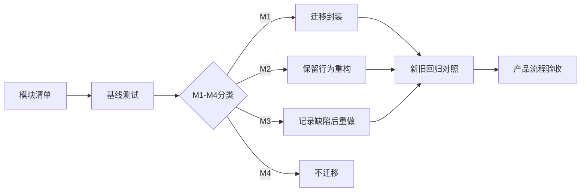

# ADR-001：已有能力迁移策略

- 状态：已接受（V2 规划基线）
- 日期：2026-07-28
- 决策范围：Coordinate Toolkit V2 产品化重构
- 关联文档：[PRD V2](../Coordinate-Toolkit-PRD-V2.md) · [TASKS V2](../Coordinate-Toolkit-TASKS-V2.md) · [Architecture](../ARCHITECTURE.md)

## 1. 背景

Coordinate Toolkit V2 不是从零开发。

`reference/map-tools` 已提供：

- 坐标转换；
- Excel、CSV、JSON 文件解析；
- 字段匹配和点位处理；
- 单点与批量转换流程；
- 高德、百度、天地图展示；
- Marker、InfoWindow 和有限图层切换；
- 地图 SDK 动态加载；
- 部分工具和大量点处理经验。

`reference/gisviewer-react` 已提供来自实际项目的地图工程经验：

- 地图容器与平台实现分层；
- 配置驱动；
- Overlay、Layer、Widget 模块化；
- 地图生命周期和资源释放；
- 聚合、海量点等渲染策略。

旧项目也存在页面耦合、状态分散、类型边界不足、地图能力不对称、SDK 生命周期不完整和 UI 风格不统一等问题。直接复制旧项目会把这些问题带入 V2；完全重写则会浪费已有成熟能力并增加回归风险。

## 2. 决策

V2 采用：

> 功能复用 + 架构重构 + UI 重做。

具体含义：

- 业务上已正确且有验证依据的逻辑优先迁移；
- 旧页面和旧目录结构不作为 V2 架构模板；
- 坐标、文件、点位和地图逻辑迁入明确模块；
- 地图 SDK 通过 MapAdapter 隔离；
- 数据模型、本地存储和 UI 重新设计；
- PeachTools Design System 作为唯一视觉与交互基线；
- 不直接修改两个参考项目；
- 不复制整个项目；
- 不重新实现已有成熟能力，除非存在明确缺陷或无法满足新契约。

## 3. 迁移分类

### M1：直接迁移封装

适用条件：

- 逻辑正确；
- 输入输出明确；
- 没有已知安全或生命周期问题；
- 可以通过适配新类型进入新模块；
- 有基线样本或可补齐回归测试。

处理方式：

- 保留算法和行为；
- 调整模块位置、类型和接口；
- 补测试；
- 不改变业务结果。

典型候选：

- 已验证的 WGS84/GCJ02/BD09 转换路径；
- SheetJS 解析 Excel 的核心思路；
- 部分纯工具函数。

### M2：保留行为重构

适用条件：

- 用户行为和业务流程正确；
- 旧结构、类型、状态或生命周期不符合 V2；
- 可以保持结果的同时重新划分边界。

处理方式：

- 固定旧行为基线；
- 将逻辑拆出页面；
- 改用新 Domain/Core 接口；
- 完成新旧行为对照。

典型候选：

- 字段映射；
- 单点/批量转换流程；
- Marker 和 InfoWindow 行为；
- SDK Promise 去重思想；
- 高德大量点分层思想。

### M3：重新实现

适用条件：

- 已确认存在正确性问题；
- 存在安全风险；
- 无法满足新契约；
- 旧实现只是空方法或未完成；
- 第三方 API 已不适用。

处理方式：

- 记录旧实现问题；
- 保留产品行为需求；
- 使用新实现；
- 增加缺陷回归测试。

典型候选：

- 字符串 `split` 的 CSV 解析；
- 未转义字符串拼接 InfoWindow；
- SDK script/callback 清理；
- 旧批量 Marker 每批清空前一批；
- 不支持能力的空实现。

### M4：不迁移

适用条件：

- 超出 V1；
- 偏离“设备点位坐标转换与地图验证工作台”定位；
- 成本明显高于当前价值；
- 属于旧 GIS 平台能力。

典型内容：

- 轨迹；
- 热力图；
- 三维地图；
- 天气；
- GeoJSON；
- 通用绘制和空间分析；
- 用户系统和后端。

## 4. 迁移流程

每项能力必须记录：

- 来源文件；
- 现有输入输出；
- 已知调用方；
- 迁移分类；
- 分类理由；
- 基线样本；
- V2 目标模块；
- 已知限制；
- 验收方式。

## 5. 迁移原则

1. 先测试旧行为，再调整结构。
2. 不因代码风格差异改变业务结果。
3. “复用”不等于复制页面、全局状态和项目结构。
4. “重构”不等于重写算法。
5. M3 必须有明确、可证明的问题。
6. 未分析的成熟逻辑不得直接删除。
7. 旧项目只读，所有适配发生在 V2。
8. 临时 legacy adapter 必须有退出计划。
9. 新抽象必须解决真实边界，不为形式增加层级。
10. PeachTools UI 重做不能改变核心业务语义。

## 6. 影响

### 正面影响

- 降低业务回归风险；
- 保留旧项目经验；
- 允许架构和 UI 独立改进；
- 为每个变更提供可追溯原因；
- 防止把旧耦合直接复制到 V2。

### 成本

- Phase 0 需要额外分析和基线测试；
- 迁移期会存在 legacy-to-domain 适配；
- 新旧结果需要并行对照；
- 不能只按新目录快速“搬文件”。

## 7. 风险

### 成熟度被高估

旧文档中部分能力标记完成，但代码为空实现。必须以源码和测试为准。

### 旧耦合被带入

为追求复用，可能把页面状态、SDK 对象和业务模型一起复制。通过迁移矩阵和 Adapter 边界控制。

### 过度重构

为追求架构纯度可能替换正确算法。M3 必须说明缺陷，不能以“更优雅”为唯一理由。

### 基线不完整

没有权威样本时无法判断差异。相关能力保持待验证，不静默宣布完成。

## 8. 未采用的方案

### 完整复制 map-tools

拒绝原因：会保留页面耦合、内存状态、空地图能力和 UI 问题。

### 完全重写

拒绝原因：重复投入、扩大精度和业务回归风险。

### 迁移 gisviewer-react 作为地图底座

拒绝原因：其核心是 ArcGIS 2D/3D，体量和能力远超 V1，且不是三家地图现成 Adapter。

## 9. 验收标准

- 存在完整 `MIGRATION-MATRIX.md`；
- 核心旧模块均有 M1–M4 分类；
- 坐标转换、文件解析和字段映射有基线测试；
- 每个 M3 项有明确缺陷说明；
- 旧参考项目没有被修改；
- V2 没有复制旧项目整体结构；
- 已迁移能力通过新旧行为对照；
- V1 排除能力未被顺带迁入；
- legacy adapter 有移除条件和责任项。

