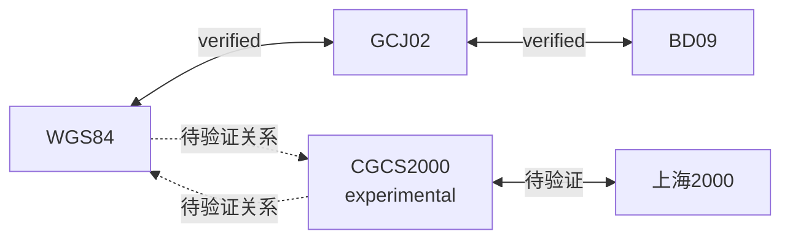

# ADR-002：坐标系统与转换架构

- 状态：已接受（上海2000与CGCS2000部分待验证）
- 日期：2026-07-28
- 决策范围：坐标模型、转换路径、算法注册和缓存
- 关联文档：[Architecture](../ARCHITECTURE.md) · [PRD V2](../Coordinate-Toolkit-PRD-V2.md)

## 1. 背景

map-tools 已实现 WGS84、GCJ02、BD09、CGCS2000、上海2000之间的转换基础，并使用 gcoord、proj4 和显式路径表。该能力应优先迁移。

旧实现的问题是：

- 转换位于 React Hook；
- 坐标系和路径以静态对象集中写死；
- CGCS2000部分按WGS84近似处理；
- 上海2000参数缺少完整来源、轴序和精度证据；
- 错误可能使用 `(0,0)` 占位；
- 缓存与算法版本尚未建立。

随着正式坐标和扩展坐标增加，使用大型 switch 编写所有 N×N 组合会难以维护和验证。

## 2. 决策

采用：

> CoordinateSystem Registry + TransformationGraph + Algorithm Registry。

CoordinateTransformer 作为 Feature 的统一入口，负责：

- 检查坐标系状态；
- 选择转换路径；
- 调度注册算法；
- 验证每一步结果；
- 返回成功或结构化错误；
- 记录算法链和版本。

不要使用大型 switch 判断所有源/目标组合。

## 3. 坐标系状态

### 正式支持

- WGS84
- GCJ02
- BD09
- 上海2000

其中上海2000已有转换基础，完成本ADR规定的验证后正式启用。

### 扩展验证

- CGCS2000

CGCS2000默认不开放用户入口。它可以先作为 Registry 中的扩展节点，用于：

- 上海2000转换链验证；
- 天地图坐标契约验证；
- 未来业务场景。

是否开放为导入源或转换目标，需要独立业务确认。

## 4. CoordinateSystem Registry

每个定义包含：

| 信息 | 用途 |
| --- | --- |
| id | 稳定系统标识 |
| displayName | 用户显示名称 |
| kind | geographic/projected |
| unit | degree/meter |
| axisOrder | 系统内部统一轴顺序 |
| status | verified/experimental/disabled |
| userVisible | 是否作为用户入口 |
| importable | 是否允许作为导入源 |
| targetable | 是否允许作为目标 |
| definitionVersion | 定义版本 |
| provenance | 标准、参数或资料来源 |

新增坐标系首先注册定义，不在页面添加散落判断。

## 5. TransformationGraph

坐标系是节点，已注册的直接转换算法是有向边。

路径规则：

1. 只使用启用的算法边；
2. 优先步骤更少的路径；
3. 同等步骤优先精度等级更高的路径；
4. experimental边不能被正式流程静默使用；
5. 路径记录每条算法边的ID和版本；
6. 同系转换不执行有损算法。

WGS84到BD09可以组合WGS84→GCJ02→BD09，无需单独实现所有组合。

## 6. Algorithm Registry

每个算法记录：

- algorithmId；
- source；
- target；
- version；
- status；
- precisionClass；
- supportsBatch；
- provenance；
- 参数版本；
- 测试样本集合。

map-tools已有逻辑迁移方式：

| 旧能力 | 处理 |
| --- | --- |
| gcoord WGS84/GCJ02/BD09 | 建立基线后注册为算法边 |
| TRANSFORM_PATHS | 转换为Graph边和路径策略 |
| proj4 SH2000/CGCS2000 | 保留基础，验证后注册为verified |
| CGCS2000≈WGS84 | 不直接注册为verified等价边 |

## 7. 上海2000验证

上海2000不是“无法实现”。已有proj4基础，但开发阶段必须完成：

1. 参数来源确认；
2. EPSG代码或正式投影定义确认；
3. 椭球、中央经线、比例因子、假东/假北确认；
4. X/Y轴顺序确认；
5. 单位确认；
6. 至少三组权威双向样本；
7. 可接受精度标准；
8. 适用区域说明。

验证前算法状态为experimental；验证通过后转为verified并允许用户使用。

参数改变必须增加算法或定义版本，不能原地覆盖后继续使用旧缓存。

## 8. CGCS2000策略

- Registry中预留；
- 默认 `userVisible=false`；
- 未确认场景前不作为普通导入选项；
- 不默认认为与WGS84完全等价；
- 天地图Adapter不得自行决定转换关系；
- 真实业务样本和平台契约确认后，通过新ADR决定其最终状态。

## 9. 转换结果和错误

转换结果使用成功/失败的判别式结构。

失败至少区分：

- INVALID_COORDINATE；
- UNSUPPORTED_SYSTEM；
- SYSTEM_NOT_ENABLED；
- NO_TRANSFORMATION_PATH；
- ALGORITHM_NOT_VERIFIED；
- TRANSFORMATION_FAILED；
- CANCELLED。

失败不返回伪造坐标，不将 `(0,0)` 作为错误占位。

## 10. 算法版本规则

算法版本在以下情况增加：

- 算法库升级且结果可能变化；
- 参数变化；
- 投影定义变化；
- 轴顺序修正；
- 精度算法变化；
- 直接边改为不同转换实现。

版本标识需要稳定且可比较。转换结果记录综合算法版本；多步路径记录路径中每条算法的版本，并生成可用于缓存比较的版本签名。

只修改UI显示精度不增加算法版本。

## 11. 缓存失效规则

缓存命中需要同时满足：

- 目标坐标存在；
- CoordinateSystem definitionVersion一致；
- transformation path signature一致；
- algorithmVersion一致；
- 原始坐标未变化。

以下情况失效：

- 算法升级；
- 上海2000参数确认或修正；
- 坐标定义/轴序变化；
- 路径选择策略导致实际算法链变化；
- 用户明确要求重新计算。

缓存失效只删除/重算converted，不修改original。

## 12. 影响

### 正面影响

- 可扩展CGCS2000而不修改所有页面；
- 复用旧算法；
- 每条转换可测试和追溯；
- 缓存与算法版本一致；
- 避免大型switch。

### 成本

- 需要Registry和Graph；
- 必须维护算法来源和版本；
- 上海2000启用前需要验证工作；
- 多步路径需要综合错误和精度。

## 13. 未采用的方案

### 所有组合写在一个switch

拒绝原因：组合增长快、重复、无法按边验证和扩展。

### 把CGCS2000直接等同WGS84

拒绝原因：两者是不同坐标基准，必须根据实际场景和误差确认。

### 重新实现全部算法

拒绝原因：map-tools已有基础，应先验证迁移。

## 14. 验收标准

- Registry包含四个正式系统和CGCS2000扩展节点；
- 页面不硬编码转换矩阵；
- Graph只使用已启用算法；
- Algorithm记录来源和版本；
- WGS84/GCJ02/BD09旧结果回归通过；
- 上海2000验证项全部有结论；
- CGCS2000默认不显示；
- 错误不返回伪坐标；
- 版本变化能使相关缓存失效；
- original永不因重算被覆盖。

