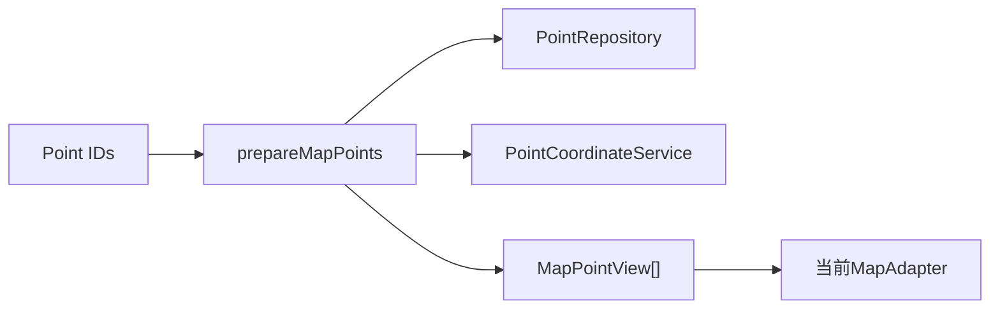

# ADR-003：多地图 Adapter 架构

- 状态：已接受
- 日期：2026-07-28
- 决策范围：高德、百度、天地图接入
- 关联文档：[Architecture](../ARCHITECTURE.md) · [Reference Analysis](../REFERENCE-ANALYSIS.md)

## 1. 背景

map-tools 已分别通过 `useAmap`、`useBmap`、`useTianditu` 接入三家地图，并提供相似Hook接口。已有Marker、InfoWindow、图层和SDK加载逻辑值得迁移。

旧结构的问题：

- 页面同时创建三个Hook；
- 公共接口包含平台未实现的绘制和测量；
- 不支持能力以空方法表示；
- SDK加载、坐标转换、Marker和工具集中在Hook中；
- 生命周期和全局callback清理不完整；
- 地图页面直接理解平台细节。

gisviewer-react提供了统一容器、平台实现类、配置驱动和destroy等参考，但其ArcGIS重型架构不适合直接迁移。

## 2. 决策

采用：

> MapCore + MapAdapter + ProviderRegistry + Capability。

实现三个Adapter：

- AMapAdapter；
- BaiduAdapter；
- TiandituAdapter。

地图页面不直接调用SDK。每个页面只创建当前平台Adapter。

## 3. MapCore

MapCore是小型契约集合，不是大型运行时框架。

包含：

- Provider ID；
- MapAdapter契约；
- MapPointView；
- MapEvent；
- MapError；
- Capability；
- ProviderRegistry；
- Adapter契约测试。

MapCore不包含：

- PointRepository；
- CoordinateTransformer；
- 通用Geometry；
- 通用Layer模型；
- 插件运行时；
- GIS空间分析。

## 4. MapAdapter职责

Adapter负责：

| 能力 | 责任 |
| --- | --- |
| SDK初始化 | 请求Loader并创建地图实例 |
| Marker | 创建、替换、清除点位覆盖物 |
| InfoWindow | 安全展示点位名称和平台坐标 |
| fitView | 单点合理缩放，多点适配范围 |
| baseLayer | 在Capability允许时切换有限底图 |
| events | 把SDK事件转换为标准事件 |
| destroy | 释放地图实例、覆盖物、事件和临时资源 |

Adapter不负责：

- 查询Point；
- 坐标转换；
- IndexedDB；
- 文件解析；
- 页面Toast；
- 用户选择状态。

## 5. MapPointView

Adapter只接收已经准备好的地图点位视图：

- id；
- name；
- x；
- y。

不接收完整Domain Point，不读取original/converted，不自行决定目标坐标系。

地图坐标准备由map-validation feature完成：



## 6. ProviderRegistry

每个平台注册：

- provider ID；
- Adapter factory；
- SDK版本；
- 凭据类型；
- 目标坐标契约；
- 默认中心和缩放；
- 基础图层；
- Capability；
- 启用状态。

Registry不保存真实Key/Token。

页面通过Registry选择Adapter，不使用散落的provider条件判断。

## 7. Capability机制

V1基础Capability：

- markers；
- infoWindow；
- fitView；
- baseLayer（平台验证通过时）。

后续可选：

- clustering；
- massivePoints；
- drawing；
- distanceMeasure；
- areaMeasure。

规则：

1. UI只显示当前Provider声明的Capability；
2. Adapter必须通过对应Capability契约测试；
3. 不支持时不提供空函数；
4. Capability不进入Domain Point；
5. 不因一个平台支持就强迫所有平台实现；
6. 绘制和测量不属于V1基础能力。

## 8. SDK Loader

Loader与Adapter实例分离。

加载键包含：

- provider；
- SDK version；
- credential fingerprint；
- 插件集合。

Loader负责：

- 无凭据时拒绝加载；
- 并发去重；
- script标识；
- 全局callback管理；
- SDK ready检查；
- 失败清理；
- 重试。

Loader不创建地图实例。

## 9. Marker和渲染策略

`setPoints`语义是用完整集合替换当前点位，避免旧项目分批调用时清空上一批。

平台内部可选择：

- 普通Marker；
- 聚合；
- 轻量点；
- 海量点。

同一时刻只使用一种主渲染策略。阈值由性能测试决定，不直接复制旧项目的50/1000/10000阈值。

InfoWindow内容使用纯文本或安全UI挂载，不拼接未转义HTML。

## 10. 生命周期

Adapter状态：

```text
idle → loading → ready → destroying → destroyed
                 ↘ error
```

规则：

- initialize避免重复实例；
- 页面卸载后异步结果不能继续回写；
- destroy幂等；
- 事件订阅返回unsubscribe；
- Marker、Layer、InfoWindow、timer、callback进入ResourceBag；
- 平台切换先销毁旧Adapter；
- SDK全局对象是否保留按官方建议，应用地图实例必须释放。

## 11. 明确不建设

- 通用GIS框架；
- Geometry系统；
- 通用Layer系统；
- 插件系统；
- ArcGIS式巨型Facade；
- 统一绘制引擎；
- 任意空间对象渲染体系。

如未来出现明确需求，通过独立ADR扩展Capability，而不是提前建设。

## 12. 影响

### 正面影响

- 页面与SDK隔离；
- 平台能力差异可见；
- 生命周期可测试；
- 保留旧Marker行为；
- 避免三个Hook同时实例化；
- 有利于平台替换和测试mock。

### 成本

- 需要三个Adapter和契约测试；
- 平台特有能力不能通过一个统一大接口直接调用；
- 需要维护Provider配置。

## 13. 未采用的方案

### 继续使用三个Hook并在页面switch

拒绝原因：页面耦合平台，三个Hook同时存在，能力空实现。

### 迁移gisviewer-react作为统一地图框架

拒绝原因：依赖和功能过重，目标平台不同。

### 建设通用GIS抽象

拒绝原因：超出产品定位，增加维护成本。

## 14. 验收标准

- 三个页面均只依赖MapCore，不直接调用SDK；
- AMapAdapter、BaiduAdapter、TiandituAdapter独立；
- Adapter只接收MapPointView；
- Capability控制UI；
- 不支持能力没有空方法；
- 无Key不创建SDK script；
- Marker、InfoWindow、fitView通过契约测试；
- destroy可重复调用；
- 快速切换页面无实例冲突；
- 没有Geometry、通用Layer或插件框架。

