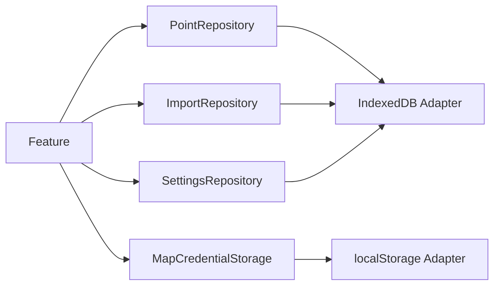

# ADR-004：本地数据存储策略

- 状态：已接受
- 日期：2026-07-28
- 决策范围：点位、导入记录、设置和地图凭据
- 关联文档：[Architecture](../ARCHITECTURE.md) · [PRD V2](../Coordinate-Toolkit-PRD-V2.md)

## 1. 背景

Coordinate Toolkit是浏览器端本地工具。V1没有：

- 用户系统；
- 多人协作；
- 云同步；
- 服务端批处理；
- 服务端权限；
- 后端数据库。

map-tools主要使用页面内存状态，刷新后点位丢失。V2需要持久保存：

- Point；
- ImportRecord；
- 转换缓存；
- 产品设置；
- 地图凭据。

数据量可能达到万级点位，不适合全部放入localStorage。

## 2. 决策

采用：

- IndexedDB保存 `points`、`imports`、`settings`；
- localStorage保存API Key、Token和少量启动配置；
- Repository模式隔离Feature与具体存储。

Repository：

- PointRepository；
- ImportRepository；
- SettingsRepository。

地图凭据使用独立MapCredentialStorage。

## 3. 为什么V1不需要后端

产品核心流程可以全部在浏览器完成：

```text
文件读取
→ 解析
→ Point标准化
→ 坐标转换
→ IndexedDB保存
→ 地图SDK显示
```

不建设后端的原因：

- V1不需要跨设备共享；
- 不需要账号和权限；
- 文件和点位可保持本地；
- 坐标转换可在浏览器完成；
- 降低部署、隐私和运维成本；
- 符合PeachTools轻量工具定位。

第三方地图SDK仍会向地图平台发出请求。UI必须说明这一边界，不能把“无后端”等同于“完全无网络”。

## 4. IndexedDB设计

数据库建议名：`coordinate-toolkit`。

### points

保存：

- id；
- name；
- source；
- original Coordinate；
- converted cache。

索引建议：

- nameNormalized；
- source.type；
- source.importId。

转换缓存随Point保存。V1不单独建设坐标结果表。

### imports

保存ImportRecord摘要：

- sourceType；
- fileName/sheetName；
- coordinateSystem；
- mapping；
- total/imported/skipped；
- createdAt。

不保存原始文件、完整行或JSON全文。

### settings

保存非敏感、可版本化的产品设置：

- theme；
- tablePageSize；
- coordinateDisplayPrecision；
- recentMapProvider；
- 基础偏好。

设置记录带schemaVersion。

## 5. localStorage设计

保存：

- 高德Key；
- 百度AK；
- 天地图Token；
- 极少量需要同步读取的启动配置。

原因：

- 地图页加载前需要快速判断凭据是否存在；
- 数据量小；
- 简化SDK Loader启动。

localStorage不是安全密钥库。规则：

- 不进入日志；
- 不放入URL；
- 不进入普通设置导出；
- 默认遮罩显示；
- UI说明保存在当前浏览器；
- 不加载不可信第三方脚本。

## 6. Repository模式



Domain只定义Repository端口，具体IndexedDB实现位于Adapter层。

### PointRepository

- add；
- addMany；
- getById；
- list/query；
- updateConvertedCoordinate；
- delete；
- deleteMany。

更新单个目标坐标时不能覆盖其他转换缓存或original。

### ImportRepository

- add；
- getById；
- list；
- 按时间/来源查询。

删除导入记录不默认级联删除Point。未来批次撤销需要独立产品决策。

### SettingsRepository

- get；
- set；
- reset；
- migrate。

Repository不直接显示Toast或依赖React。

## 7. 事务策略

需要事务：

- 导入时同时写points和imports；
- 批量删除；
- schema migration；
- 批量转换缓存分批写回。

文件导入采用原子事务：不能出现ImportRecord成功但Point未写入。

批量转换允许按批次提交：

- 单点失败不回滚其他成功点；
- 每批成功后持久化；
- 最终报告成功和失败；
- 取消只停止后续批次。

## 8. 数据迁移

### Schema migration

每个数据库版本记录：

- store变化；
- index变化；
- 序列化变化；
- 缓存失效规则；
- 升级失败处理。

迁移原则：

- original优先保留；
- 无法升级的converted可以失效重算；
- 不静默改变CoordinateSystem；
- migration必须有旧版本fixture测试。

### map-tools数据迁移

map-tools没有稳定IndexedDB数据层。若需要兼容其导出文件：

- 通过独立LegacyPointImporter；
- 映射旧originalLng/originalLat/originalCoord；
- 丢弃或显式选择rawData；
- 不把任意业务字段写入Point；
- 记录导入来源为legacy/file类型；
- 无需求时不建设自动迁移。

### 算法版本迁移

算法版本变化时：

- 保留original；
- 标记相关converted过期；
- 使用时按需重算；
- 不在数据库升级期间同步重算全部点。

## 9. 错误处理

错误至少区分：

- DATABASE_UNAVAILABLE；
- QUOTA_EXCEEDED；
- TRANSACTION_ABORTED；
- RECORD_NOT_FOUND；
- SCHEMA_MIGRATION_FAILED；
- SERIALIZATION_FAILED；
- CREDENTIAL_STORAGE_FAILED。

处理原则：

- Repository返回结构化错误；
- Feature转换为用户文案；
- 数据库失败不显示成功；
- 配额不足提示用户删除数据或导出备份；
- migration失败停止写入，避免进一步破坏；
- 不在错误中输出完整凭据或原始文件内容。

## 10. 数据生命周期

- 手动删除Point后刷新不再存在；
- 删除Point同时删除其converted；
- ImportRecord是批次摘要；
- 清除凭据只影响地图加载，不删除Point；
- 重置设置不删除Point和ImportRecord；
- 清空全部数据必须单独确认；
- V1不自动过期点位。

## 11. 影响

### 正面影响

- 刷新后数据保留；
- 支持万级点位；
- 页面与存储解耦；
- schema可演进；
- 凭据和普通设置分离；
- 不需要后端。

### 成本

- 需要schema和migration测试；
- 浏览器配额和隐私模式可能失败；
- 无跨设备同步；
- 用户清除浏览器数据后无法恢复，除非未来提供备份。

## 12. 未采用的方案

### 全部使用localStorage

拒绝原因：容量、事务、索引和大数据能力不足。

### 引入后端数据库

拒绝原因：V1没有用户、共享和云同步需求，增加隐私和运维成本。

### 页面直接操作IndexedDB

拒绝原因：耦合、难测试、难迁移。

### 单独coordinate cache store

V1暂不采用。缓存随Point存储更简单；未来算法历史或数据规模需要时再评估。

## 13. 验收标准

- IndexedDB包含points/imports/settings；
- API Key和Token只通过MapCredentialStorage访问；
- 页面不直接调用IndexedDB/localStorage；
- Repository测试覆盖CRUD和事务；
- 导入不会产生半成功记录；
- original在migration中优先保留；
- 算法升级可失效converted；
- 存储错误结构化；
- 无后端也能完成完整核心流程；
- UI说明本地数据与第三方地图请求边界。

